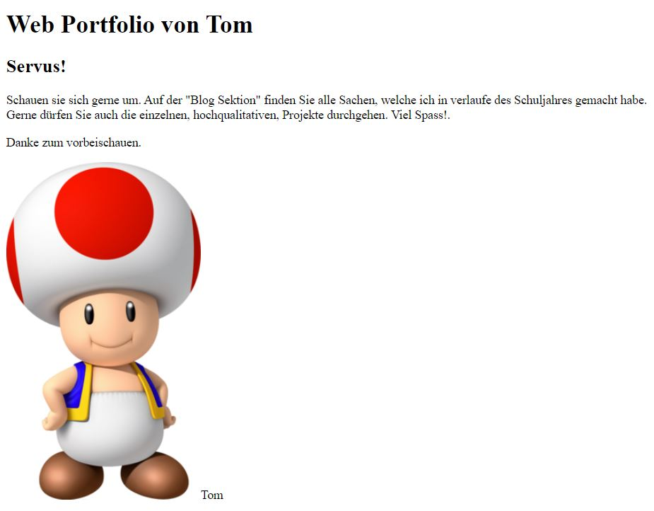

+++
title = "Programmieren #2"
date = "2021-10-26"
draft = false
pinned = false
tags = ["Hochqualitativ", "Programmieren"]
image = "programmieren-bild2.jpg"
description = "Abbildung #1: Programm des Programmierens\nAbbildung #2: Eigentliche Webseite\n\nZuerst haben wir programmiert und danach konnten wir wieder an unserem Projekt arbeiten.\nDanach haben wir bei unserem Projekt \"Madame Frigo\" weitergearbeitet."
+++

Heute haben wir das zweite Mal programmiert. Danach haben wir an unserem Projekt "Madame Frigo" weitergearbeitet. Nächstes Mal werden wir eine Umfrage durchführen.