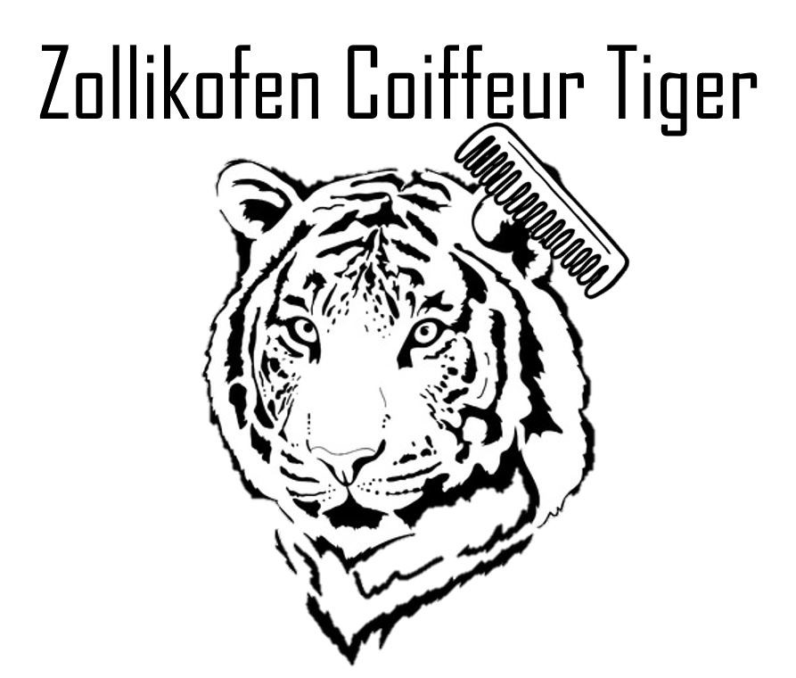

+++
title = "Semesterabschluss 2021"
date = "2022-01-11"
draft = true
pinned = false
tags = ["Hochqualitativ", "Semesterabschluss"]
image = ""
description = "Das Semester neigt sich dem Ende. In diesem Blogeintrag finde Sie eine grobe Zusammenfassung unserer Tätigkeiten im Verlaufe dieses Semesters."
+++
In den ersten paar Web-Lektionen, haben wir gelernt, wie man mit "Fever" eine Webseite erstellt. Somit haben wir (in 2-er Gruppen) eine Bildergalerie von Blumen gemacht. Das Resultat war nicht besonders schmeichelnd, aber immerhin war die Webseite im Internet auffindbar. Danach haben sich die Gruppen geändert und ich bekam einen Neuen Partner.

Anfangs haben wir gelernt, wie man eine Webseite erstellt. Danach bekamen wir den Auftrag, einen Kunden zu finden und etwas gutes für Ihn zu tun.

Somit haben wir uns als erstes Gedanken gemacht, wer ein potentieller Kunde sein kann. Nach mehreren Diskussionen sind wir zum Schluss gekommen, dass wir Kontakt zu einem Kollegen von meinem Partner aufnehmen. Da dieser Kollege in seiner Freizeit gerne die Haare seiner Freunde schneidet, haben wir uns gedacht, dass er ein potentieller Kunde werden kann. Somit haben wir ihm geschrieben und ihn gefragt, ob wir für ihn eine Webseite kreieren dürfen. Da wir eine Weile auf seine Antwort gewartet haben und davon ausgegangen sind, dass es in Ordnung sei, haben wir ein Logo erstellt.

Leider haben wir in der Woche darauf erfahren, dass unsere "Kunde" das Angebot abgelehnt hat. Er will nicht, dass sein Name im Internet auffindbar ist, da er Haare nur in seiner Freizeit für Freunde schneidet.

Somit waren wir wieder auf der Suche von einem Kunden.....

Leider lagen die Schwierigkeiten darin, einen Kunden zu finden und einen Sinnvollen Auftrag um ihm auf irgendeiner Weise zu dienen.

Somit besprachen wir die Lage mit Marco. Wir entschieden uns, einer NGO oder einer anderen Hilfsorganisation zu helfen. Somit sind wir auf "Madame Frigo" gestossen. Somit versuchten wir Kontakt mit den Mitarbeitern aufzunehmen. Als wir jedoch über mehrere Wochen hinweg, immer noch keine Antwort bekommen haben, handelten wir selbst. Wir führten ein Strasseninterview und hatten hilfreiche Informationen daraus schliessen können. Als wir danach immer noch keine Reaktion von "Madame Frigo" bekommen haben, gaben wir das Projekt auf.

Die Schwierigkeit bei diesem Kunde war das Kommunizieren. Im Nachhinein haben wir festgestellt, dass unser "Kunde" zu gross war & wir uns eher auf Einzelpersonen beschränken sollten. Somit lernten wir etwas daraus.

Somit waren wir ein weiteres Mal auf der Suche von einem Kunde...

Jedoch dauerte es nicht lange und wir hatten eine weitere Idee: Eine digitale Galerie mit den gemalten Bilder meiner Tante zu machen. Dieses Projekt ist aufregend und spannend zugleich, denn wir hatten eine weitere Herausforderung vor uns: Fotografieren. Somit liessen wir uns von Herrn Veragut (Lehrer Bildnerisches Gestalten) über die Fotografie beraten und lernten somit viel über die Lichtverhältnisse und Blickwinkel.

Somit haben wir die Fotos gemacht und jetzt stellen wir noch die Webseite dazu her.

Vor einigen Wochen hatten wir unsere Präsentation