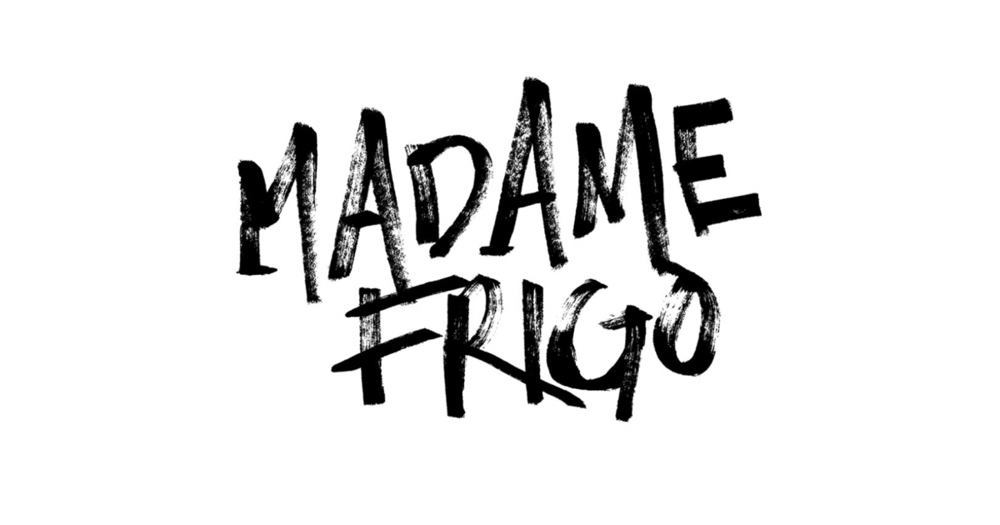

+++
title = "Semesterabschluss, Projektbericht"
date = "2022-01-18"
draft = false
pinned = false
tags = ["Hochqualitativ", "Wunderbar"]
description = "Abschluss- Zwischenbericht für unsere Projekte."
+++
# **Projektbericht 2021**

**Mit welcher Idee haben wir uns beschäftigt?**

Anfangs haben wir uns überlegt, wie wir einen Kunden finden können, und wie wir sein Bedürfnis befriedigen können. Somit haben wir in unseren Freunden/Familienkreisen und nach potentiellen Kunden gesucht. Nachdem wir die Absage von unserem ersten Kunden erhalten haben, diskutierten wir mit Marco nach weiteren Ideen. Wir entschieden uns etwas Soziales zu unternehmen. Unser letztes Projekt ist im Vergleich zu den anderen zwei, sehr persönlich.

**Wie sah unser Projekt am Schluss aus?**

Leider konnten wir keines unserer Projekte, offiziell abschliessen, sondern mussten abbrechen oder wir wurden nicht fertig. Somit ist auch nichts davon im Internet offiziell auffindbar. In unserem Projekt haben wir jedoch alles gezeigt und aufgelistet.

**Wen konnten wir als Kunden gewinnen?**

Unsere Zielgruppe der "Kunden" waren die Freunde und Familie, wobei wir erst gegen Ende des Semesters Erfolg hatten. Unsere Kunden waren Freunde, Familie und eine NGO. Leider fanden wir keinen langfristigen Kunden.

Hier ein Bild von einem Logo für unseren ersten potentiellen Kunden:

Hier ein Bild des Logos der NGO, für welche wir gearbeitet haben: 

**Falls keine Kunden gefunden: Was war die Schwierigkeit, dass wir keine Interessen finden konnten?**

Wir liessen uns bei Marco beraten und fragten in unseren Familien und Freundeskreisen intensiver nach. Die Schwierigkeit lieg nicht nur darin, einen Kunden zu finden, sondern eine Dienstleistung mit welcher man den Kunden glücklich machen kann.

**Was lernen wir aus unseren Projekten?**

Für kleine Projekte von Schülern ist es sinnvoll, kleine Unternehmen bzw. Einzelunternehmen als Kunden anzufragen. Grossunternehmen oder NGO's haben meistens zu viel zu tun, oder sie haben ihre Bedürfnisse bereits befriedigt. Wir lernten, wie man Professionell Kontakt in der Arbeitswelt aufnimmt und wie man mit kritischen Situationen umgeht.

**Was habe ich über meine Interessen gelernt?**

Da wir uns vor allem mit unserem sozialem Projekt auseinandergesetzt haben, hat sich meine Denkweise und somit Interesse über die Nachhaltigkeit und Ökologie verändert. Somit bin ich mir darüber bewusster und achte mich in meiner Freizeit mehr.

**In welchen Themen möchte ich mich weiter vertiefen?**

Im nächsten Semester möchte ich eine Art Projekt für mich selber machen. Dabei bin ich mir noch unschlüssig, wie genau dieses Ablaufen wird, aber schlussendlich sollte es im Internet auffindbar sein.